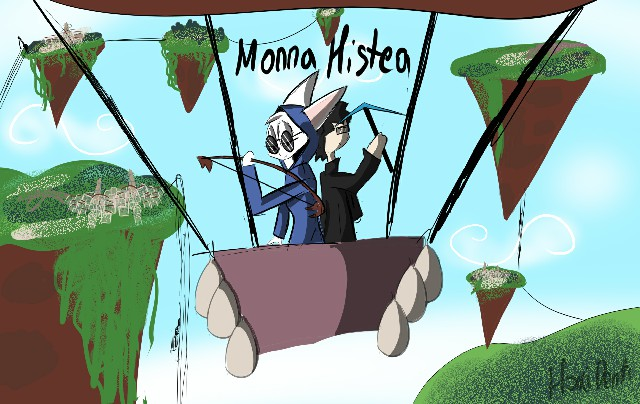

# Monna Histea Blog

* [▶️YouTube](https://www.youtube.com/channel/UCMWGELHuJKEkrd-FhlsuLzg)
	* Канал з новинами
	* Покищо в розробці
* [👾HaxiDenti (Автор)](haxidenti.md)
	* Хто такий Автор
	* Як так вийшло що він створив `Monna Histea`?
* [❤️Що таке Monna?](whatIsMonna.md)
	* Опис Канону та Лору
* [🧾Повнометражні Оповідання](books/Books.md)
	* Повноцінна історія, та лінійний сюжет
* [📔Короткометражні Оповідання](books/short/ShortBooks.md)
	* Короткоментражні історії, що не мають зв'язку між собою по порядку читання
	* "Диванна Історія", як жанр Сіткому але в текстовому форматі
* [🙍Персонажі](char/Characters.md)
	* Інформація про Лор персонажів
	* Розповідь та характеристики
* [⚙️Механіка](mech/Mechanics.md)
	* Розповідь про те, чого все так, а не інакше
* [📖Історії](story/Stories.md)
	* Історичні відривки та/або шматки історичних подій
* [🧾Легенди та Міфи](legends/Legends.md)
	* Щось з цього правдиве, а щось залишається таємницею
* [📔Планується Або не планується](plan/Plans.md)
	* Шматки, або уривки сюжету, що увійдуть або не увійдуть у лор
* [⁉️Питання та відповіді](faq/FAQ.md)
	* Різного роду питання
	* Навіть максимально дурні
* [Астеріонська Мова](lang/AsterionQue.md)
	* Як виглядає мова тамтешніх персонажів