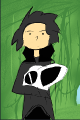

# Ihor HaxiDenti Fox

## Хто такий
* `HaxiDenti` в реальному житті називається `Ігор`.
* В кругу друзів, знайомих, та рідних відомий як `Ihor Fox`
* Програміст, розробник програмного забеспечення для `Backend` на мові програмування `Java/Kotlin`
* Пише як хоббі - розповіді на вільній основі для себе, друзів, і вирішив попробувати на ширшу авдиторію
* Паралельно займається розробкою програм для створення новел, інтерактивних квестів, і таке інше, що сприяє творчості інших людей.

## Background
* Народився на Львівщині у маленькому селі у Бідній сім'ї.
* За походженням Українець
* Лінія батька походить з Росії, а по Лінії матері з Європейських країн
* Напівсирота, батько покинув сім'ю, коли було 8 років
* Хворів п'ять разів на пневмномію, та був присмерті два рази
* Пообіцяв мамі що кимось стане коли виросте
* Виріс в малозабеспеченій сім'ї, на шиї дідуся та бабусі
* Вчився у академії для сиріт та бідних сімей `Hebron IT`

## Як прийшов до Монни?
* З першого класу писав вірші, та хотів написати перше оповідання.
* Був улюбленцем (або не дуже) вчителів Української мови завдяки старанності в предметі
* Незважаючи на Українську мову, писав перші оповідання на Російській, вважаючи її доступнішою для Українців та людей за кордоном.
* Перше оповідання було `Хістерія`, що прославилась в кругу любителів подібного жанру. Це була розповідь про так-званого Інеса та його білу дракончиху, з якою вони собі жили на Варитському острові.
	* Твір був Фанфиком до Мультфільму "Як приборкати дракона" (Перша частина)
	* В оповіданні розказувалась історія про кволого хлопця, що хворів якоюсь хворобою, і перед смертею відпустив дракончиху наволю
	* Проте драконесса не втекла, а врятувала його певним чином, а потім і викрала його
	* Твір став дуже популярним, і за тиждні набрав десь з 10 тисяч переглядів.
	* Нажаль мав популярність з-поміж 10-12 річних дітей, однак це теж було щось.
	* Даний твір було видалено (Крінж :) )
* Наступною "Гістерією" були ще декілька фанфиків.
	* "Німфі Хісті" - Вперше згадувалась така собі Німферія, як персонаж, та її подруга Тіффія. Надихнувся грою Діна Додріла `Dust an Elysian Tale` де головним персонажем виступав вовк Фуррі, та його маленький друг Німбат Фіджет. Криклива зараза, в яку неможливо не закохатись. Тіффі же була копія Німфі, тільки іншого, фіолетового кольору.
	* `Нічні Зірки` та `Політ в нічному небі` - Вперше згадується Алдія Найтстар. Оповідання було написано в передноворічну ніч, і викладено десь на новий рік в 2013 році. Метою такого оповідання було привітати читачів з Новим роком. Розповідалось про нещасну Фенек лисичку, що блукала на пляжі острову, і молилась Тіні (Місяцю, на який вона думала, що це її мама). В якийсь момент, місяць пустив промені на Алді, і забрав її. Твір вийшов дуже сумний, і знову таки людям сподобався.
		* Ніколи б не думав, що Алдія пізніше зможе мені поміняти життя.
* Пізніше надихався творінням художниці Вів'єн Медрано, вона ж на даний момент творець "Пекельного Боса" та "Готель Газбін"
	* В 2016 році, Віві'єн випускає комікс, що називається "Зоофобія". Історія про якесь підземне місто у склі, де живуть демони та тварини, й переховуються від світу людей.
	* Головний персонаж Кемерон, хвора на голову персонажиня, консультується з лікарем, що рекомендує їй змінити офісну роботу, на іншу
	* Після цього, вона шукає іншу роботу, і знаходить дивну вакансію, по догляду за тваринами. І так, як вона любить тваринок, вона хотіла б туди потрапити.
	* Відповідно її приймають, але жінка, що приймала її, насправді була якоюсь феєю, і коли Кемерон летіла в літаку, то вона тільки тоді почала розуміти, що людей навколо нема, а за бортом літає якась перната тварюка.
	* І в цілому вона приземляється, і потрапляє у світ, де всі звірі, і не тільки. Вона всього боїться, і відповідно так і починається розповідь.
	* В свій час я надихнувся цією історією, і написав відповідний план, що називався `Одді Міллер - Хранителі Ангори`. В планах було придумати щось подібне, але про Ангелів та Демонів, з головним персонажем в ролі Екзорциста.
* На третьому курсі училища, створив був ідею, для написання книги про Марс, та в подібному плані, що було про Ангелів та Демонів.
	* `Eneopsis - The Mars Project`
	* По факту головний персонаж Немесі Авілія, що збирала зап частини зондів, та роботів на червоній планеті.
	* Коли вчені дізнались про існування життя на марсі, вони одразу почали будувати колонії, та виловлювати створінь, для того, аби проводити дослідження
	* Авілія знайомиться з роботом, Б1 що слугував штучним інтелектом та збирачем. Він приносив всякий брухт до бази, але його покинули. Авілія принесла його до перевалу, й відремонтувала.
	* Відтоді вони стали друзями
	* По сюжету Батько Авілії Рандер, каже що вибиратись до людей, та таскати всяке з їх лігва, це самогубство. Авілія спочатку в таке не вірить, аж поки не потрапляє у пастку
* Перебуваючи на навчанні у Академії `Hebron IT`, прийшла в голову написати ще одну книгу (В цей раз не план). Називалась вона "Новий Світ", або ще "Digital World".
	* Була ідея запхати Німфі, Алдію, та решту персонажів у якийсь віртуальний світ, де все б нагадувало гру, але при тому можна було в неї потрапити, й вибратись
	* Вона була посиланням на реальну гру, яку я хотів зробити, практикуючись в знаннях `php` мови (Майже першої мови програмування, після `Basic`). Я хотів написати свою першу гру, де буде відкритий світ, і повна воля дій. Однак навичок не вистачило на той час.
	* Це був віртуальний світ, насичений віртуальними звірятами, при вбивстві яких випадали "Світлячки" або якась інформація, з якої можна було створити ще щось, або перетворити на фрагменти і творити нові виміри. Концепт полягав в тому, що душа була цифровим ядром, яке треба було вибити, і воно після смерті, коли хижак поїдав плоть, поверталось у якусь квітку, і з часом, звіря могло відродитись.
	* Ідея нікому не зайшла, того я відкинув. Також пізніше керівник прочитав цю "книжку", і сказав що таке не годиться, і не пасує аби студенти таким займались, так як Академія про Бога, і про віруючих. А ця книга, по мірках власника Академії була "проти Бога". Він попіклувався аби я зростав з Богом, а не писав віршики та книжки про те, чого не існує. Так ідея вмерла не народившись. Проте було кілька артів, де згадувались три персонажі:
		* Кірбі, Алдія, та Сильвія
* Ось вже на дворі 2018 рік, і я вступаю на свою першу роботу `Java Trainee Developer`, де починаю вникати в світ розробки, на такій мові, як `java`. В мою голову приходить створити гру знову по тому світу, але на той час подібна гра з такою-ж назвою існувала. Того я не спішив писати книгу з такою назвою. Ба більше, існувала навіть "Хістерія" як рок група (здається), від чого я теж не міг називати книгу так.
	* У вихідний час, я бавився з `javascript es5`, де практикував написання першого міні движка для створення лінійних новел `MyStory` (Хз, як ще його можна було назвати, в той момент принаймні)
	* На цьому "движку" я був написав першу лінійну новелу, яка називалась "Останній Хранитель" і була про Алді Найтстар. Саме там у неї появився сюжет, та були якісь початки. Історія була на сторінці ВК, того це все загубилось з часом.
	* Однак малюючи не першого персонажа, в один момент мені прийшла в голову ідея, назвати Гістерію, "трішки інакше". Наприклад вигаданою мовою, якою спілкуються Астеріонці (Ті самі персонажі). Хм.. Я подумав що буде непогано.
	* В той момент виходить назва "Histea". Але звучить воно якось таке собі. Воно мало б означати Хістерія, однак аби "Паливно" не було. Але в Астеріонській мові, дівчина називається "Monna", а так як перша дракончиха білого коліру називалась Хістерія, і вона була дівчиною, я вирішив дати відповідну назву.
	* На світ появилась назва "Monna Histea"
	* Ідея була створити світ, де всі ті персонажі об'єднались в одному світі, і взаємодіяли.
	* Перша версія такої "Монни" вийшла під назвою "Велика Історія", або Legia Spelia. Це був збірник фанфиків на сайті ficbook.net (Новый мир - Все ще зберігся на сайті, того можна знайти).
		* Туди входили "Хістерія", "Хістерія 2", "Хістерія 3", "Німфі Хісті", "Нічні Зірки", "Останній Хранитель", та "Останній подих" про апокаліпсис та "останні серії" наших персонажів. Йой яка ж у мене тоді фантазія була.
	* Пізніше "Monna Histea" була переписана більше десяти разів, і постійно мінялась. Аж поки не дійшов до якогось консенсусу, де скажу "Ось воно". Від тоді пройшло ще 5 років, і ось вже 2024 рік. І даний Блог ведеться починаючи з теперішньої дати.
